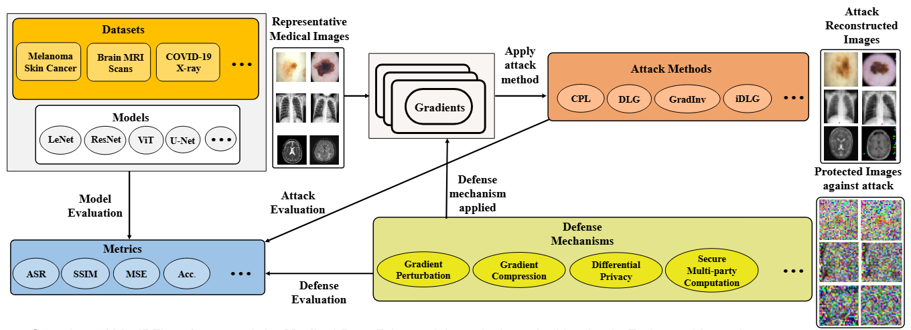

# MedPFL
The repository contains the source code for the paper entitled "In-depth Analysis of Privacy Threats in Federated Learning for Medical Data"
The arxiv version of the paper can be found at: https://arxiv.org/pdf/2409.18907?

# Framework Overview

**Abstract:** Federated learning is emerging as a promising machine learning technique in the medical field for analyzing medical images, as it is considered an effective method to safeguard sensitive patient data and comply with privacy regulations. However, recent studies have revealed that the default settings of federated learning may inadvertently expose private training data to privacy attacks. Thus, the intensity of such privacy risks and potential mitigation strategies in the medical domain remain unclear. In this paper, we make three original contributions to privacy risk analysis and mitigation in federated learning for medical data. First, we propose a holistic framework, MedPFL, for analyzing privacy risks in processing medical data in the federated learning environment and developing effective mitigation strategies for protecting privacy. Second, through our empirical analysis, we demonstrate the severe privacy risks in federated learning to process medical images, where adversaries can accurately reconstruct private medical images by performing privacy attacks. Third, we illustrate that the prevalent defense mechanism of adding random noises may not always be effective in protecting medical images against privacy attacks in federated learning, which poses unique and pressing challenges related to protecting the privacy of medical data. Furthermore, the paper discusses several unique research questions related to the privacy protection of medical data in the federated learning environment. We conduct extensive experiments on several benchmark medical image datasets to analyze and mitigate the privacy risks associated with federated learning for medical data.

# How to use
To reproduce the results or run on custom dataser, please place the dataset in the corresponding folder, and run the notebooks for each methods as placed in the corresponding folders by name. For defense, please run the defense notebooks in the defense folder. 

# Publications
The initial findings of the paper has been published in the IEEE International Conference on Bioinformatics and Biomedicine (BIBM 2023)

The paper can be found at: https://ieeexplore.ieee.org/abstract/document/10385829

# Citation
Please cite as follows.

@article{das2024depth,
  title={In-depth Analysis of Privacy Threats in Federated Learning for Medical Data},
  author={Das, Badhan Chandra and Amini, M Hadi and Wu, Yanzhao},
  journal={arXiv preprint arXiv:2409.18907},
  year={2024}
}

@inproceedings{das2023privacy,
  title={Privacy risks analysis and mitigation in federated learning for medical images},
  author={Das, Badhan Chandra and Amini, M Hadi and Wu, Yanzhao},
  booktitle={2023 IEEE International Conference on Bioinformatics and Biomedicine (BIBM)},
  pages={1870--1873},
  year={2023},
  organization={IEEE}
}

